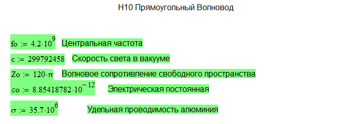
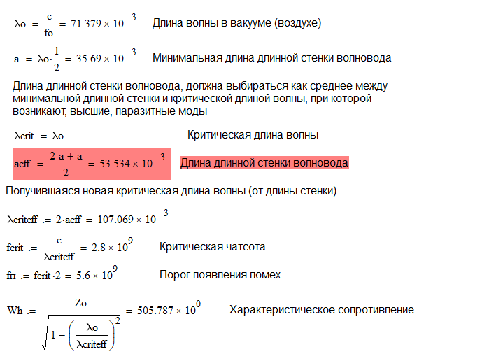
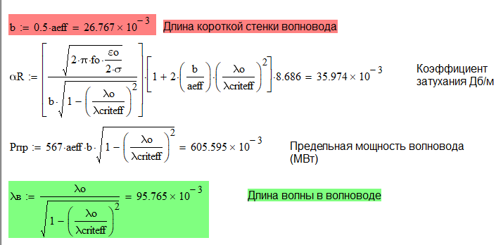
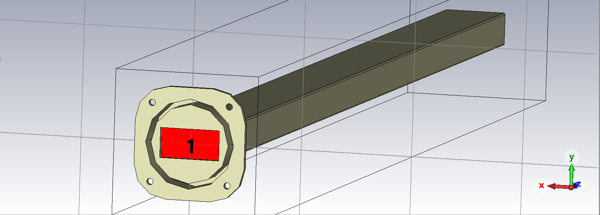
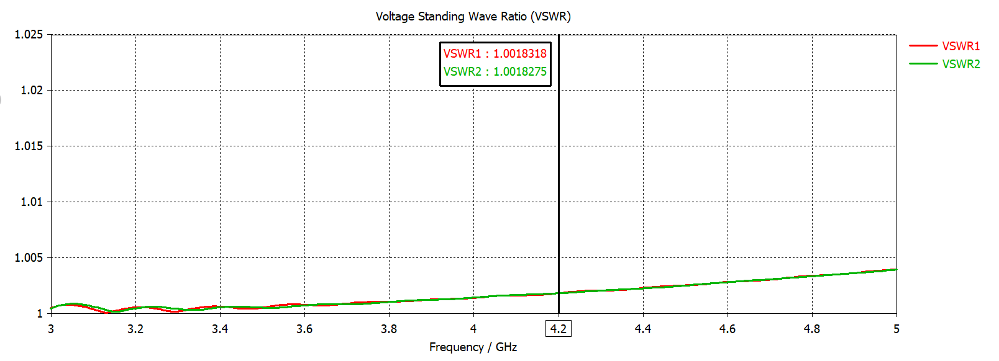
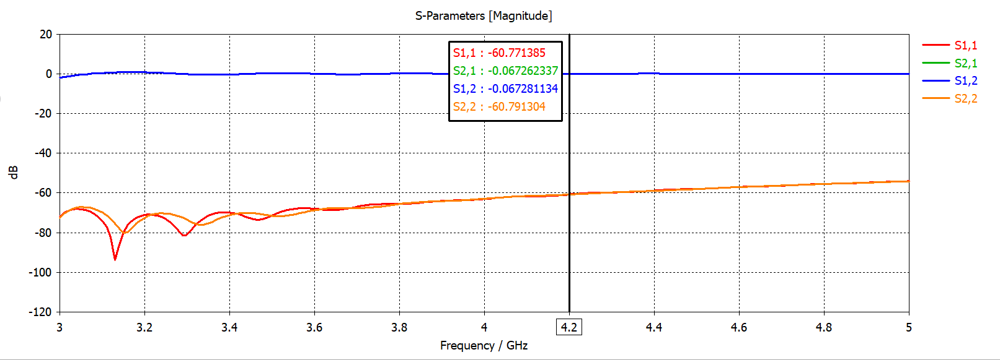
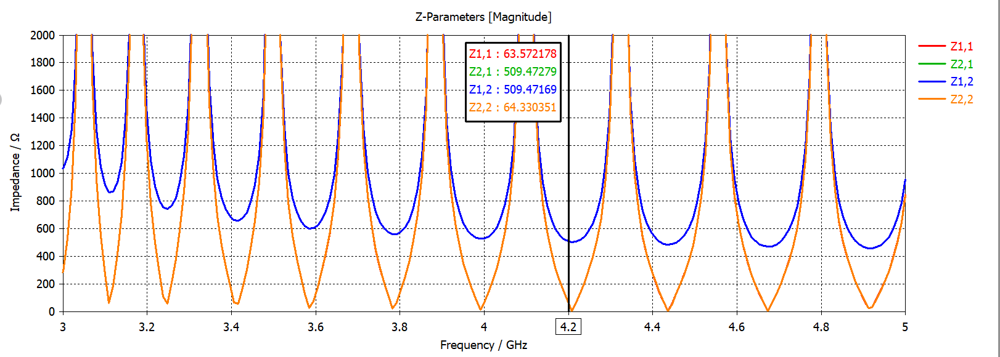

<p align="center">
  <a href="README.md">Русский</a> | <a href="README.en.md">English</a> | <b>Deutsch</b>
</p>

# Rechteckhohlleiter für den $H_{10}$ ($TE_{10}$) Modus (4,2 GHz, C-Band)

Dieses Repository enthält Entwicklungsunterlagen, analytische Berechnungen und numerische 3D-Elektromagnetiksimulationen für einen Rechteck-Hohlleiterabschnitt im Grundwellenmodus $H_{10}$ ($TE_{10}$) bei einer Mittenfrequenz von $f_0 = 4{,}2\text{ GHz}$ (C-Band).

Das Projekt umfasst analytische Berechnungen in PTC Mathcad, parametrische 3D-CAD-Modelle mit Anschlussflansch (SolidWorks / STEP) sowie eine elektromagnetische Verifikation in CST Studio Suite.

---

## Projektstruktur

```text
rectangular-waveguide-4.2ghz/
├── cad/                  # 3D-CAD-Modelle (SolidWorks SLDPRT, STEP-Format)
├── calculations/         # Analytische Berechnungen in PTC Mathcad (.xmcd)
├── docs/images/          # Berechnungsblätter, 3D-Modellansichten und Simulationsdiagramme
└── simulation/           # Elektromagnetisches Simulationsprojekt in CST Studio Suite (.cst)
```

---

## Analytische Berechnung

Die analytische Dimensionierung des Hohlleiters wurde in PTC Mathcad auf Basis der Maxwellschen Gleichungen für metallische Hohlleiter durchgeführt.



### 1. Ausgangsparameter und physikalische Konstanten
- **Mittenfrequenz**: $f_0 = 4{,}2\cdot 10^9\text{ Hz}$ ($4{,}2\text{ GHz}$)
- **Lichtgeschwindigkeit im Vakuum**: $c \approx 2{,}998\cdot 10^8\text{ m/s}$
- **Wellenwiderstand des Freiraums**: $Z_0 = 120\pi \approx 376{,}73\ \Omega$
- **Elektrische Feldkonstante**: $\varepsilon_0 \approx 8{,}854\cdot 10^{-12}\text{ F/m}$
- **Leitermaterial**: Aluminiumlegierung mit spezifischer Leitfähigkeit $\sigma = 35{,}7\cdot 10^6\text{ S/m}$

### 2. Geometrische Abmessungen und Einmodenbandbreite
Freiraumwellenlänge:
$$\lambda_0 = \frac{c}{f_0} = 71{,}379\text{ mm}$$

Zur Gewährleistung der Monomode-Ausbreitung des $H_{10}$-Modus und zur Unterdrückung höherer Moden ($H_{20}$, $H_{01}$) wurden die Innenmaße bestimmt:
- Minimale Breite der breiten Wand: $a_{min} = \frac{\lambda_0}{2} = 35{,}69\text{ mm}$
- Ausgewählte Breite der breiten Wand: $a_{eff} = 53{,}534\text{ mm}$
- Höhe der schmalen Wand ($b = 0{,}5 \cdot a_{eff}$): $b = 26{,}767\text{ mm}$



### 3. Elektrodynamische Kennwerte
- **Grenzwellenlänge ($H_{10}$)**: $\lambda_{crit} = 2 \cdot a_{eff} = 107{,}069\text{ mm}$
- **Grenzfrequenz ($H_{10}$)**: $f_{crit} = \frac{c}{\lambda_{crit}} = 2{,}80\text{ GHz}$
- **Schwelle höherer Moden**: $f_{high} = 2 \cdot f_{crit} = 5{,}60\text{ GHz}$
- **Wellenwiderstand des $H_{10}$-Modus**:
  $$W_h = \frac{Z_0}{\sqrt{1 - \left(\frac{\lambda_0}{\lambda_{crit}}\right)^2}} = 505{,}787\ \Omega$$
- **Hohlleiterwellenlänge**:
  $$\lambda_B = \frac{\lambda_0}{\sqrt{1 - \left(\frac{\lambda_0}{\lambda_{crit}}\right)^2}} = 95{,}765\text{ mm}$$



- **Dämpfungskonstante (Leiterverluste)**: $\alpha_R = 35{,}974\cdot 10^{-3}\text{ dB/m}$ ($0{,}036\text{ dB/m}$)
- **Maximale übertragbare Leistung (Luftdurchschlag)**: $P_{max} = 605{,}595\text{ kW}$

---

## 3D-Modellierung

Die Hohlleitergeometrie wurde in SolidWorks modelliert und in CST Studio Suite verifiziert. Das Modell umfasst ein Innenprofil von $53{,}534 \times 26{,}767\text{ mm}$ sowie einen Flansch mit 4 Befestigungsbohrungen und Zentrieransatz.



- **Randbedingungen**: Offene Randbedingungen in Ausbreitungsrichtung, verlustbehaftete metallische Wandungen gemäß Aluminiumleitfähigkeit.
- **Wellenleiter-Ports**: Waveguide Ports (Port 1 und Port 2) an den Hohlleiterenden zur Anregung der $TE_{10}$-Grundwelle.

---

## Simulationsergebnisse

Die elektromagnetische 3D-Simulation wurde im Frequenzbereich von $3{,}0\text{ bis }5{,}0\text{ GHz}$ durchgeführt.

### 1. Stehwellenverhältnis (VSWR)


Bei der Mittenfrequenz von $4{,}2\text{ GHz}$ wurden folgende Werte ermittelt:
- $\text{VSWR}_1 = 1{,}00183$
- $\text{VSWR}_2 = 1{,}00183$

Im gesamten Frequenzbereich von $3{,}0\text{ bis }5{,}0\text{ GHz}$ liegt das VSWR unter $1{,}004$, was eine reflexionsarme Anpassung belegt.

### 2. Streuparameter (S-Parameter)


Bei der Mittenfrequenz von $4{,}2\text{ GHz}$:
- **Reflexionsfaktor ($S_{11}, S_{22}$)**: $-60{,}77\text{ dB}$ / $-60{,}79\text{ dB}$ (Rückflussdämpfung $> 60\text{ dB}$).
- **Transmissionsfaktor ($S_{21}, S_{12}$)**: $-0{,}067\text{ dB}$ (äußerst geringe Durchgangsdämpfung über die Bauteillänge).

### 3. Impedanzparameter (Z-Parameter)


Bei $4{,}2\text{ GHz}$:
- **Kopplungsimpedanz ($Z_{21}, Z_{12}$)**: $509{,}47\ \Omega$.

Die simulierte Kopplungsimpedanz $Z_{21} \approx 509{,}5\ \Omega$ weist eine hohe Konvergenz mit dem analytischen Wellenwiderstand $W_h = 505{,}79\ \Omega$ auf (Abweichung unter $0{,}73\%$, bedingt durch Leitungslängentransformation und Portrandeffekte).

---

## Lizenz

Copyright (c) 2026 Ilya Kornilov

Diese Quelle beschreibt Open Hardware (offene Hardware) und ist unter der CERN-OHL-P v2 lizenziert. 
Sie dürfen diese Quelle unter den Bedingungen der CERN-OHL-P v2 (https://cern.ch/cern-ohl) 
weiterverbreiten, modifizieren und Produkte auf deren Grundlage herstellen.

Diese Quelle wird OHNE JEGLICHE AUSDRÜCKLICHE ODER STILLSCHWEIGENDE GEWÄHRLEISTUNG vertrieben, 
EINSCHLIESSLICH DER GEWÄHRLEISTUNG DER MARKTGÄNGIGKEIT, ZUFRIEDENSTELLENDEN QUALITÄT ODER EIGNUNG 
FÜR EINEN BESTIMMTEN ZWECK. Die geltenden Bedingungen entnehmen Sie bitte der CERN-OHL-P v2.
